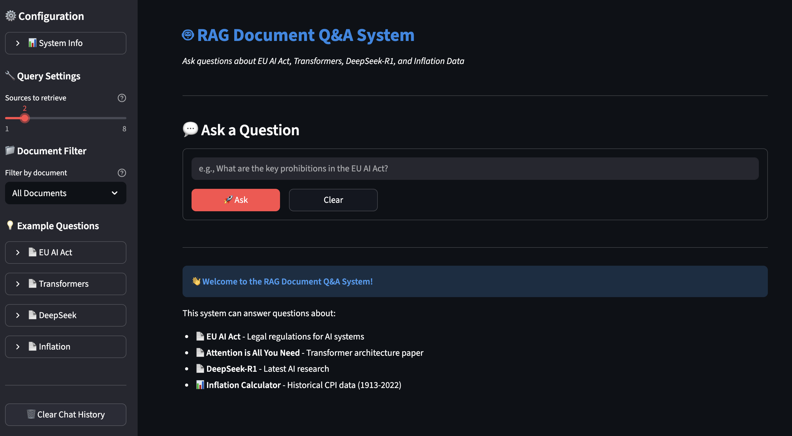
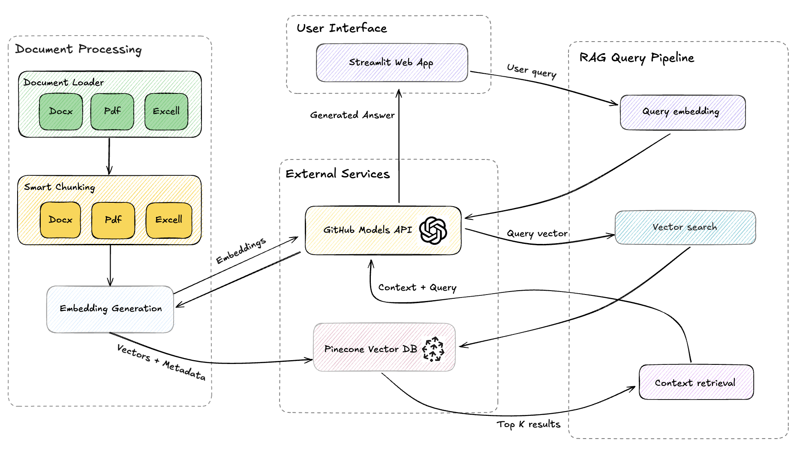
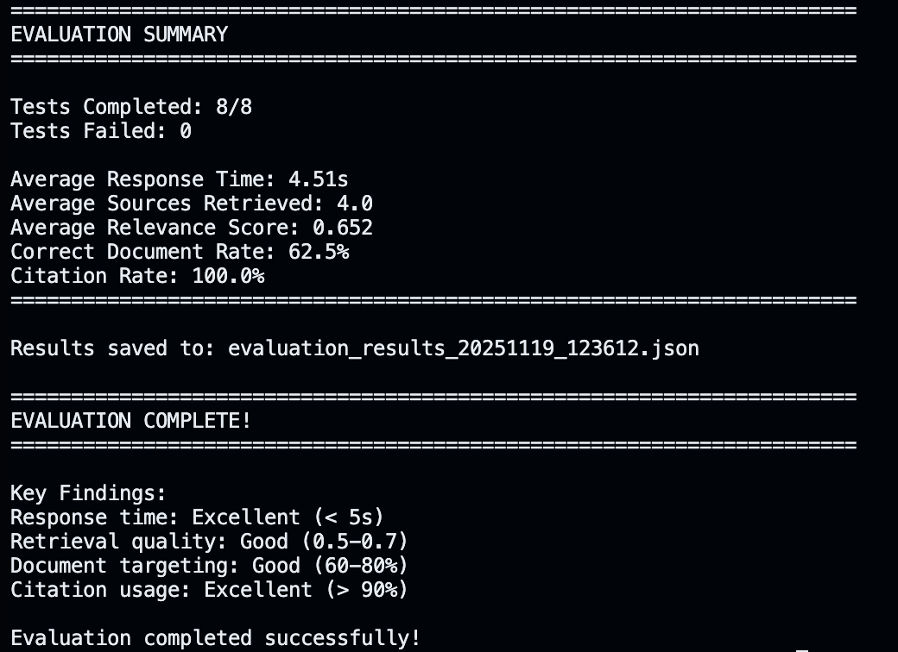

# Multi Document based RAG Q&A System

A Retrieval-Augmented Generation system that answers questions across multiple document types using semantic search and LLM generation.



## Overview

This system processes and queries four different document types:
- EU AI Act (DOCX) - Legal regulations
- Attention is All You Need (PDF) - Transformer architecture paper  
- DeepSeek-R1 (PDF) - AI research paper
- Inflation Calculator (Excel) - Historical CPI data (1913-2022)

Users can ask natural language questions and receive answers with source citations.

---

## Architecture

The following diagram shows a high-level overview of the system architecture. 



The system has following main components.

A. Data loading

Every document type has a separate loader.

- **Word loader**: Uses python docx to extract text and create sections.
- **PDF loader**: Uses PyPDF to extract text and track page numbers.
- **Excel loader**: Reads the sheets, finds the Year column, creates summary rows, year rows and decade rows.

Each loader returns structured chunks with text and metadata.

B. Chunk creation

- Each document is split into chunks that are easy for retrieval.
- Character based recursive splitting is used for Word and PDF files.
- Excel uses row level chunks with summaries for better search.

C. Embeddings and vector storage

- Embeddings are created using `text-embedding-3-small` tthrough he GitHub Models API endpoint.
- Pinecone is used as the vector store.
- All chunks are stored with metadata that helps filtering and citation.

D. Retrieval and generation

The RAG system follows this flow.

Step 1. Create embedding for the user question.

Step 2. Query Pinecone for the most relevant chunks.

Step 3. Build a context block from the retrieved chunks.

Step 4. Send the context and the question to the large language model.

Step 5. The model answers only from the provided context.

Step 6. The answer includes citations from the retrieved items

whereas LangChain is used for the chat model wrapper.

E. The User interface is a Streamlit app.

---

## Setup & Installation

### Prerequisites
- Python 3.11+
- GitHub token with Models API access
- Pinecone account (free tier)

### Local Development

1. **Clone and install:**
```bash
# Clone and install
git clone https://github.com/mehreentahir16/multi-document-rag.git
cd multi-document-rag
python -m venv venv
source venv/bin/activate
pip install -r requirements.txt
```

2. **Configure environment:**

```bash
cp .env.example .env
# Edit .env with your API keys:
# - GITHUB_TOKEN (from GitHub Settings > Developer > Tokens) make sure it has read permissions to GitHub Models
# - PINECONE_API_KEY 
# ...
```

3. **Create Pinecone index:**
- Go to [pinecone.io](https://www.pinecone.io/) console
- Create index: name="multi-document-rag".
- Choose configurations: `text-embedding-3-small`, dimension=1536, metric="cosine"

4. **Build vector index (one-time):**
   
```bash
python build_index.py
```
This processes all documents and uploads 200+ chunks to Pinecone.

5. **Run application:**
   
```bash
streamlit run app.py
```

## Deployment

### Local Docker

```bash
# Build
docker build -t multi-doc-rag .

# Run locally
docker run -p 8000:8000 --env-file .env multi-doc-rag
```

### Azure (Auto-deployment)

The repo is configured for automatic deployment via GitHub Actions.

1. Create Azure Web App (Container, Linux, Free tier).
2. Add all the environment variables listed in .env file in Azure Configuration:
   - GITHUB_TOKEN
   - PINECONE_API_KEY
   - PINECONE_INDEX_NAME
   - WEBSITES_PORT=8000
   - ...
3. Get publish profile (Web App → Get publish profile)
4. Add GitHub secret: AZURE_WEBAPP_PUBLISH_PROFILE (paste XML)
5. Push to main and `.github/workflows/azure-deploy.yml` handles build and deployment automatically.

---

## Key implementation decisions and rationale

### 1. Separate loaders per document type

PDFs, Word files and Excel sheets have very different structure.
Separate loaders give better control over extraction and chunking.
It's more code but much better retrieval quality as well.

### 2. Variable Chunk Sizes

Different documents need different context windows:
- **Technical papers (1800 chars):** Complex concepts need more context
- **Legal docs (1500 chars):** Balance structure and searchability  
- **Tabular data (500 chars):** Each row is self-contained

### 3. Pinecone vs Local Vector DB

Pinecone is a managed service with fast queries and easy scaling. Which means not having to worry about managing the infrastructure or the service 
and DB can be scaled for production purposes. It performs network calls instead of local speed but is definitely simpler for cloud use.

### 4. GitHub Models for embeddings and chat

GitHub Models allow you access to same OpenAI models and API and offer a free tier for easy access and prototyping. There are rate limits (10-15 req/min) in place which are acceptable for demo but one would have to switch to other manged providers like Azure OpenAI for production use cases.

### 4. LangChain Integration

LangChain provides standard interface and makes it easy to swap models or add features later.

---

## Evaluation Results

Ran 8 test queries across all document types. The following image summarize the evaluation results.



---

## Known Limitations

### Numerical Reasoning
The system retrieves CPI values accurately but doesn't perform calculations automatically or consistently. When asked "What would $25 in 1950 be worth in 2020?", it provides the CPI values and formula but doesn't calculate the result. However, it may compute the results when the gap between the specified years is less. For instance, it computes the adjusted value when asked: "Calculate the inflation adjusted value of $25 in 2020 as compared to 2015". 
One possible reason could be that the standard RAG excels at retrieval and text generation, but not computation. Howver, this limitation could be addressed with function calling or calculator tool integration.

### Context Window
By default, the system retrieves top-4 chunks (~4000 chars). Complex queries spanning many document sections might benefit from more context. Hence, a slider is provided to adjust the top-k chunk, though retrieving more chunks would increase latency.

### Cross-Document Queries

While the system can retrieve from multiple documents simultaneously, synthesizing information across very different sources (e.g., legal + technical + numerical) can sometimes lack depth compared to single-document queries.

---

## Future Improvements

- Add functionality to upload documents via UI.
- Add function calling for numerical calculations.
- Implement re-ranking for better retrieval accuracy.
- Add query rewriting to improve search quality.
- Add conversation memory for multi-turn dialogue.
- Streaming responses for better UX.
- Migration to Azure OpenAI for production scale.

---
